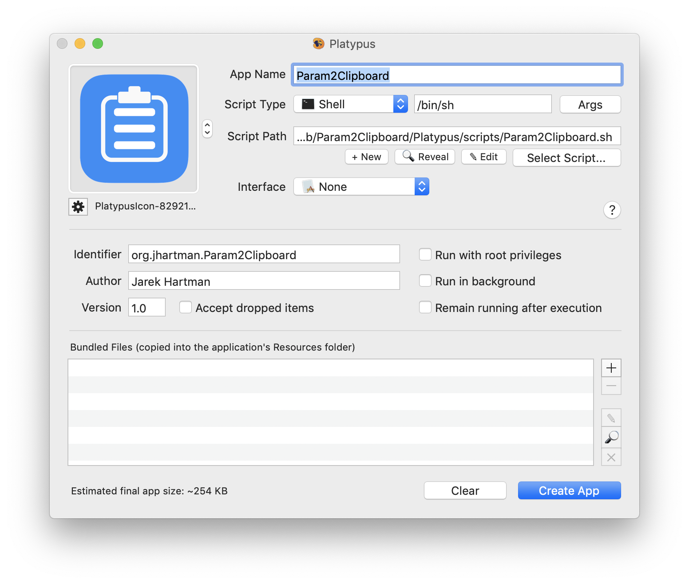
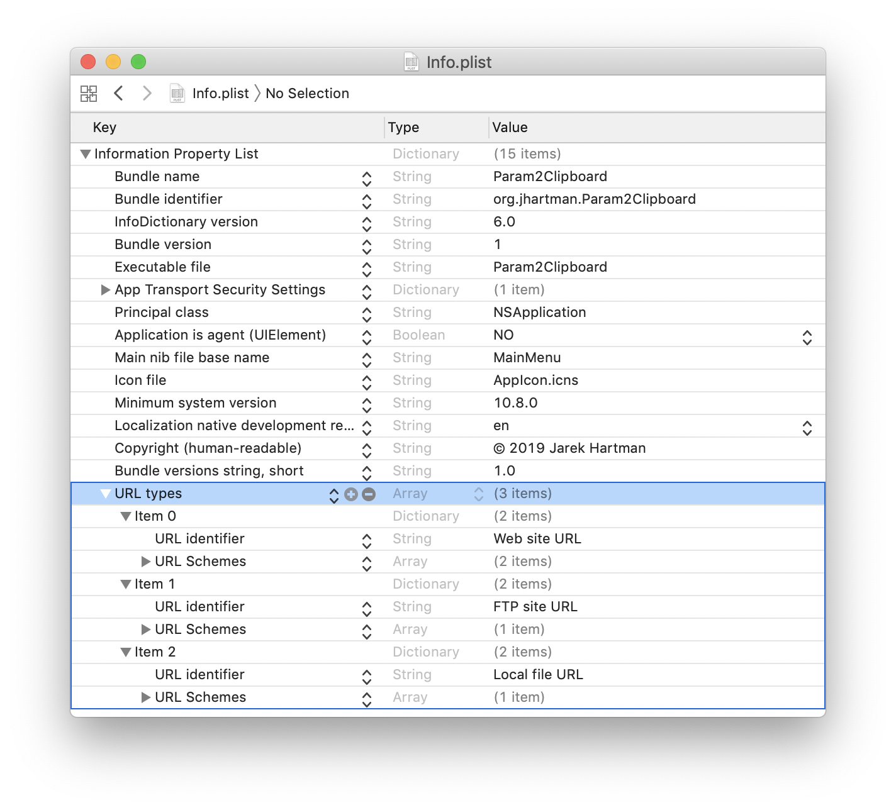
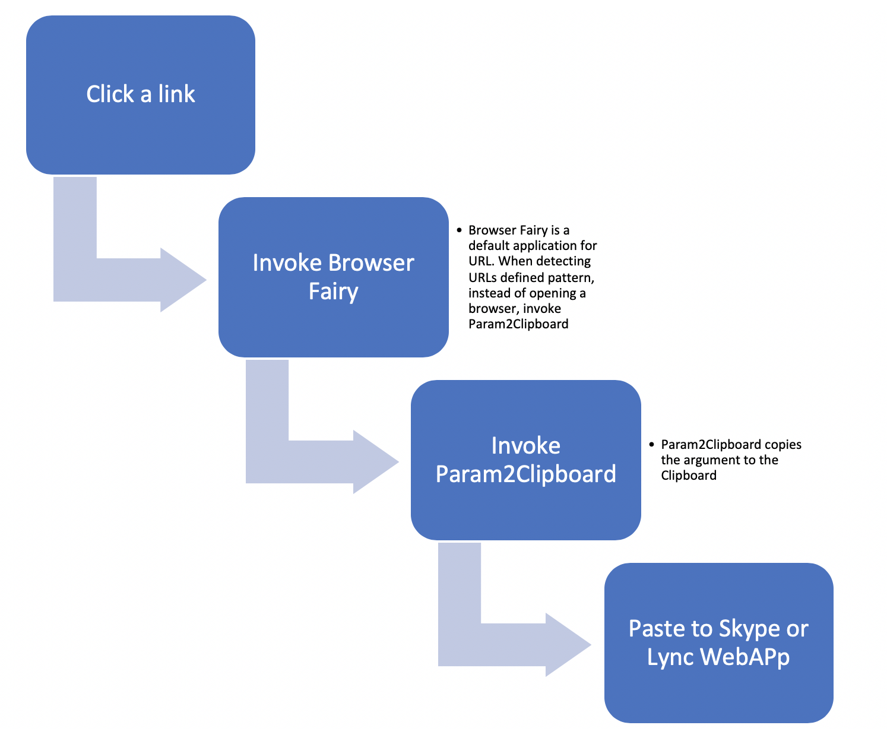
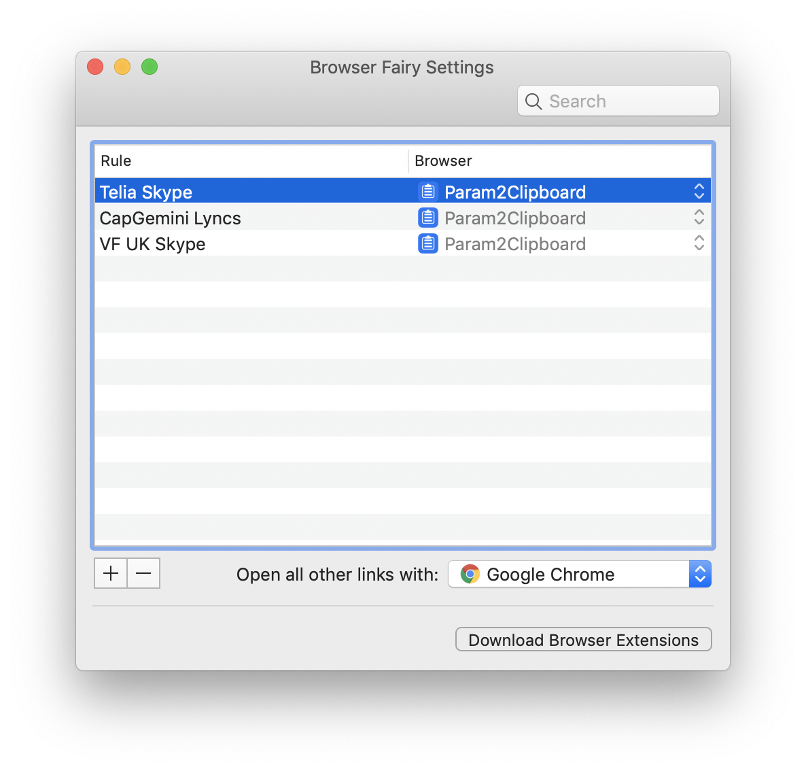
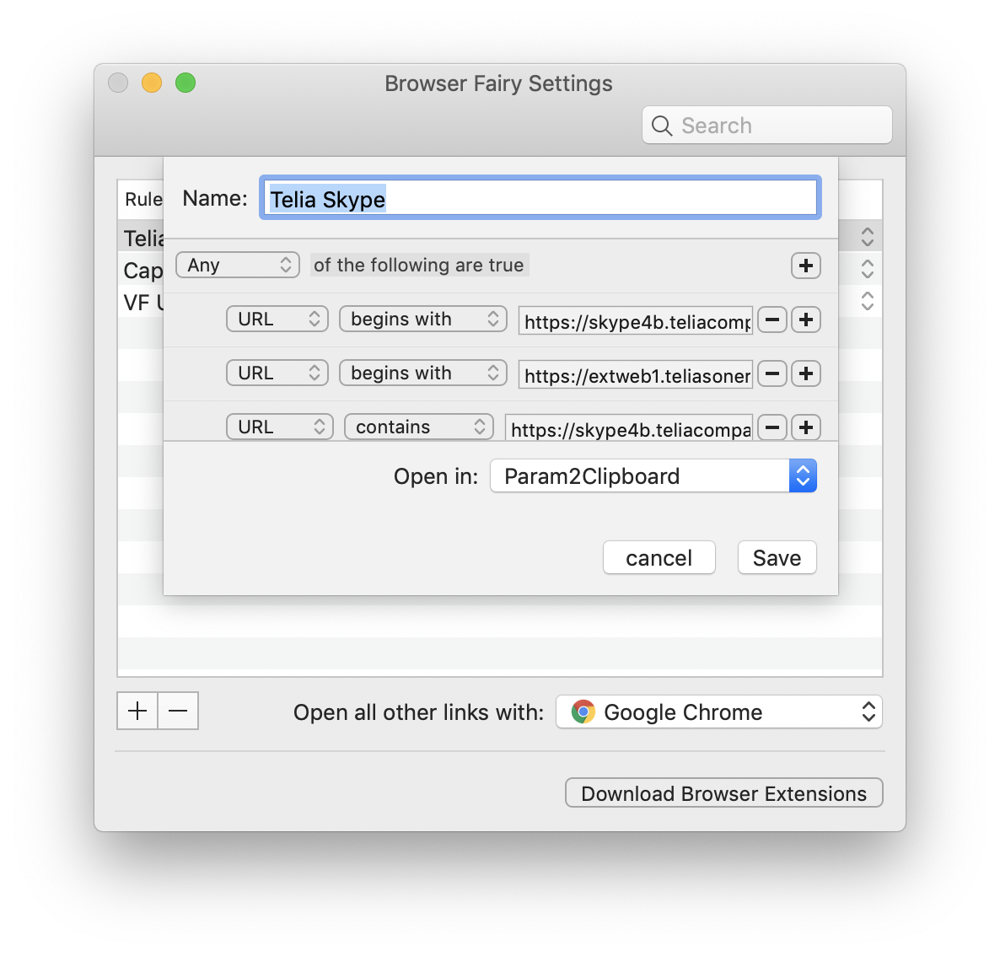

# Param2Clipboard

A MacOS application to grab an argument and set system Clipboard as per the argument.

## How it works?

Under the hood it's invoking `pbcopy` as below:

```
#!/bin/bash

if [[ -z "$1" ]]
then
  osascript -e 'display notification "Nothing copied!" with title "Param2Clipboard"'
else
	echo "$1" | pbcopy
	osascript -e 'display notification "Parameter copied to the Clipboard!" with title "Param2Clipboard"'
fi
```

The script has been wrapped into MacOS app using Platypus:



Eventually, registered required `URL Types` in `Info.plist`. Unfortunately, it was a manual process which has to be repeated every time when a new app is created using Platypus:



## Why created?

Created to improve workflow when opening Microsoft Skype or Lync meetings.

### Flow I'm using:


### Broswer Fairy configuration

In order to capture opening of Skype/Lync URLs, I'm using Browser Fairy which is registered as a default app to open all URLs. Each URL is matched against defined list of patters and if a Skype URL is detected, the URL is passed to Param2Clipboard app.





# References

* [Platypus](https://sveinbjorn.org/platypus)
* [Browser Fairy](http://www.browserfairy.com/)
* [Icon by Robb](https://dribbble.com/shots/1648648-Clipboard-Icon)